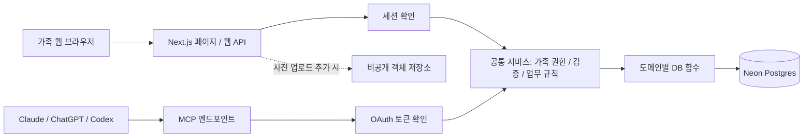

# 가족 생활 데이터 앱 — 아키텍처 설계 (v3 제안)

> 구현 버전과 달라진 선택, 배포·검증 범위는 [배포 안내](deployment.md)를 기준으로 확인한다. 아래는 설계 기준이며 아직 제공하지 않는 후속 기능도 포함한다.

> 검토일: 2026-09-08. v2의 Next.js + Vercel + Neon 방향을 유지하면서 가족 공동 사용, 외부 접속, 여러 AI의 MCP 연결을 반영했다. 구현 전 제안이며 배포·연결 검증을 완료했다는 의미는 아니다.
>
> 화면·데이터·MCP 기능: [서비스 설계](service-design.md). 원본 요구사항: [홈카페](home-cafe/DESIGN.md), [기존 와인 스킬](wine-celler/skill.md).

## 1. 목적과 사용 조건

- 커피 원두와 와인 셀러를 시작으로 생활 데이터를 저장·시각화하는 가족용 웹 앱이다.
- 가족들이 집 밖에서도 각자 휴대폰으로 접속하며 PC에서도 같은 앱을 사용한다.
- 하나의 앱 안에서 홈 / 커피 / 와인 / 설정 페이지를 이동한다.
- 웹 직접 입력과 Claude·ChatGPT·Codex 등의 MCP 입력이 같은 데이터를 다룬다.
- 가족 공용 목록·재고와 개인별 평가·세팅을 구분한다. MVP에서는 개인별 기록도 가족에게 공유한다.
- 페이지 진입 시 자동 조회, 저장 후 갱신, 다른 사용자/AI의 변경은 새로고침으로 확인한다. 실시간 구독은 두지 않는다.
- 첫 버전의 AI 대화는 외부 AI 앱에서 한다. 웹 내장 채팅은 후속 기능으로 제안한다.

## 2. 기존 설계 검토

| v2의 판단 | v3 검토 |
|---|---|
| Next.js 하나에서 웹·API·MCP 제공 | 유지. 현재 규모에서는 별도 백엔드 배포의 이득이 적다. |
| Neon Postgres, 서버 경유 DB 접근 | 유지. 관계형 데이터·재고 트랜잭션에 적합하다. |
| 도메인 MCP 도구 + 공통 서비스 함수 | 유지. 웹과 AI가 같은 검증·권한·재고 규칙을 사용한다. |
| 1인 앱이므로 인증 불필요 | 수정. 인터넷에 공개되는 개인 데이터 API는 사용자 수와 무관하게 접근 제어가 필요하다. 가족별 로그인을 둔다. |
| 서버 경유이므로 RLS 등 보안 개념이 불필요 | 수정. 애플리케이션 권한 검사는 필수다. RLS는 추가 방어로 선택할 수 있다. |
| Neon은 Auth를 제공하지 않음 | 오래된 설명. 현재 관리형 인증이 있다. 웹 로그인과 MCP용 OAuth 발급 호환성은 별도로 검토한다. [공식 소개](https://neon.com/blog/neon-auth-branchable-identity-in-your-database) |
| Supabase는 불필요한 기능만 추가 | 가족 로그인·사진 저장이 필요해져 유효한 대안이다. 무료 프로젝트 비활성 일시정지와 유료 운영을 구분한다. [공식 정책](https://supabase.com/docs/guides/platform/free-project-pausing) |
| 이미지 저장은 거의 필요 없음 | 상품 이미지 표시는 이미 요구사항이다. 원격 이미지로 시작하되 실패 처리와 라벨 업로드 확장 경로를 둔다. |
| `@vercel/mcp-adapter` 사용 | 현재 Vercel 문서는 `mcp-handler`를 안내한다. SDK와 어댑터 호환 버전을 고정한다. [공식 가이드](https://vercel.com/docs/mcp/deploy-mcp-servers-to-vercel) |
| 커피는 Apps Script에서 마이그레이션 | v2에만 있는 설명이다. 홈카페 문서에는 구조와 초기 목록이 있으며, 실제 운영 데이터 존재 여부는 아직 확인되지 않았다. |

## 3. 추천 구성과 대안

**추천 기본안: Next.js + TypeScript + Vercel + Neon Postgres + Drizzle + Better Auth.**

Better Auth를 앱에 통합하고 MCP에는 OAuth Provider 플러그인을 사용하는 안을 우선 검증한다. 웹 계정과 AI에 위임한 사용자를 같은 계정으로 연결하기 쉽고 별도 인증 서버 배포를 줄일 수 있다. 다만 관리형 인증보다 라이브러리 업데이트, OAuth 설정, 키 관리 책임이 늘어난다. 플러그인의 OAuth 발급 기능과 실제 세 클라이언트 연결 호환성을 구분한다. [Better Auth OAuth Provider](https://better-auth.com/docs/plugins/oauth-provider)

| 안 | 적합한 경우 | 운영·주의점 | 판단 |
|---|---|---|---|
| Neon + Better Auth / OAuth Provider | 기존 DB 방향을 유지하며 웹·MCP 인증 통합 | 인증 코드·키·업데이트 직접 관리 | 현재 추천, 0단계에서 연결 검증 |
| Neon + 관리형 인증 | 인증 운영을 외부에 맡기고 싶음 | Neon Auth 등 후보의 가족 접근 제어와 MCP OAuth 발급·등록 호환성 확인 필요 | 인증 운영을 줄이는 대안 |
| Supabase DB + Auth + Storage | 가족 로그인과 사진 업로드를 묶고 싶음 | 무료 비활성 일시정지 고려. MCP용 토큰·scope·discovery 호환성은 별도 확인 | 현실적인 대안 |
| 자가 서버 + DB + VPN | 모든 사용자가 사설망에서 이용 | 패치·백업·클라우드 AI 연결 운영 부담 | 이번 외부 접속 조건에서는 후순위 |

DB 선택만으로 MCP 인증 문제가 해결되지는 않는다. 데이터 모델을 본격 구현하기 전에 **실제 세 AI에서 인증된 조회 도구 하나를 연결**한다. 이 단계에서 호환성과 운영 부담이 맞지 않으면 인증 제공자를 교체한다.

초기는 단일 Next.js 프로젝트로 충분하다. 모노레포 관리 도구, 마이크로서비스, Redis, 메시지 큐, 벡터 DB, 독립 에이전트 서버는 실제 필요가 생길 때 추가한다.

## 4. 전체 구조와 코드 경계



- 웹 API와 MCP는 같은 서비스 함수를 호출하는 별도 입구다. MCP가 웹 API를 다시 HTTP로 호출할 필요는 없다.
- Server Component도 서버에서 인증된 서비스 함수를 직접 호출할 수 있다. 브라우저 코드에는 DB 라이브러리·연결 정보를 넣지 않는다.
- MCP는 도구 호출 규약이다. 별도 LLM 서버가 필수인 것은 아니다. 초기 추천·라벨 해석은 연결한 외부 AI가 수행한다.
- 웹 채팅을 추가하면 로그인 사용자의 권한으로 같은 서비스 함수를 호출하게 한다. 모델 API 비용·대화 보관 정책은 그때 설계한다.

```text
src/
  app/
    (auth)/login/
    (auth)/consent/            # AI 연결 권한 동의
    (family)/layout.tsx        # 공통 메뉴·가족 표시
    (family)/page.tsx          # 홈
    (family)/coffee/           # 원두·브랜드·평가·세팅
    (family)/wine/             # 셀러·소비·시음·와인잔
    (family)/settings/         # 가족·AI 연결 관리
    api/auth/[...all]/         # 인증 라이브러리 라우트
    api/coffee/                # 웹 API
    api/wine/
    api/mcp/route.ts           # MCP 어댑터
    .well-known/               # MCP resource / OAuth discovery
  modules/
    coffee/{schema,service,repository,tools}.ts
    wine/{schema,service,repository,tools}.ts
    household/{schema,service,repository}.ts
  server/
    auth/                     # 세션·토큰 → ActorContext
    db/                       # 서버 전용 연결·DB 스키마
    mcp/                      # 도구 등록·오류 변환
  components/                 # 공통 UI·차트
db/migrations/
scripts/import/
docs/
```

도메인의 `schema`는 입력·출력 검증, `service`는 업무 규칙·권한·트랜잭션, `repository`는 쿼리, `tools`는 MCP 호출 연결을 담당한다. 인증 테이블·추가 라우트는 채택 라이브러리 버전의 공식 스키마에 따른다.

## 5. 로그인과 가족 권한

### 5.1 가족이 사용하는 방식

**로그인은 필요하되 별도 비밀번호 가입 절차는 최소화한다.** 기본은 Google 간편 로그인 + 가족 이메일 허용 목록이다. 가족의 계정 사정에 따라 이메일 로그인 링크 등을 추가할 수 있다.

1. 운영자가 최초 소유자와 가족 공간 1개를 초기화한다. 첫 방문자를 자동 소유자로 만들지 않는다.
2. 소유자가 설정에서 가족 이메일·역할을 허용한다.
3. 인증 제공자에서 해당 이메일 소유가 검증된 경우에만 가족 멤버십을 발급한다. 계정은 제공자의 안정적인 사용자 ID에 연결한다.
4. 휴대폰에서 세션을 유지하고 로그아웃·만료·기기 분실 시 재인증한다.

공개 회원가입·가족 공간 생성 UI는 MVP에 필요 없다. 인증 성공 자체로 가족 데이터 접근권이 생기지 않는다. 멤버 비활성화 시 기존 세션·MCP grant를 폐기하고 이후 요청에서도 활성 멤버십을 검사한다.

| 권한 | owner | member |
|---|---|---|
| 공용 데이터 조회·제품 등록·구매·소비 | 가능 | 가능 |
| 개인 평가·세팅 작성·수정 | 본인 기록 | 본인 기록 |
| 가족 허용 목록·역할·가족 설정 | 가능 | 불가 |
| AI 연결 관리 | 본인 연결 및 가족 연결 강제 폐기 | 본인 연결 |
| 잘못된 공용 기록 정정·보관 | 가능, 이력 기록 | 본인 작업 정정, 이력 기록 |

가족별 취향은 분리하되 재고는 공유한다. 다른 가족의 평가를 덮어쓰지 않는다. 추후 비공개 메모를 추가한다면 MCP·집계에도 같은 공개 범위를 적용해야 한다.

### 5.2 서버 구현 규칙

- 검증된 `ActorContext { userId, householdId, role, scopes, channel, clientId? }`를 서비스에 전달한다. 가족·작성자는 입력 JSON을 믿지 않고 인증·멤버십에서 결정한다.
- 조회·수정·집계·내보내기 모두 `household_id`로 제한한다. 관련 레코드도 같은 가족인지 검사하고 가능한 관계에 `(household_id, id)` 복합 FK를 둔다.
- 메뉴 숨기기나 Middleware 검사만으로 보호하지 않는다. API·Server Action·서비스의 데이터 접근에서 검사한다. [Next.js 인증 가이드](https://nextjs.org/docs/app/guides/authentication)
- 세션은 HttpOnly·Secure 쿠키로 관리한다. SameSite와 인증 라이브러리의 CSRF 보호를 적용하고 쿠키 인증 변경 API의 Origin·CSRF 대책을 구현한다. GET으로 데이터를 변경하지 않는다.
- MVP는 서버 경유와 공통 권한 검사로 시작할 수 있다. RLS 추가 시 우회 권한 없는 DB 역할과 트랜잭션 단위 사용자 컨텍스트를 사용하고 실제 격리를 시험한다. 가족 ID 컬럼만으로 격리가 되지는 않는다.

## 6. 여러 AI에서 사용할 MCP

### 6.1 연결과 인증

- 운영 주소는 고정 HTTPS URL, 예: `https://<앱 도메인>/api/mcp`. 웹 로그인 쿠키와 별개로 사용자에게 위임받은 OAuth access token을 사용한다.
- Streamable HTTP를 기본으로 하며 프로세스 메모리의 세션·재고·중복 방지 상태에 의존하지 않는다. 어댑터의 추가 전송 방식이 외부 저장소를 요구하면 필요한 방식만 활성화한다.
- MCP 서버는 OAuth resource server, 인증 계층은 authorization server다. `mcp-handler` 인증 래퍼가 발급 서버까지 대신 구현하는 것은 아니다.
- Authorization code + PKCE(S256), protected resource metadata, authorization server discovery, redirect URI 검증, 토큰 갱신·폐기를 제공한다.
- 토큰 서명/활성 상태·issuer·audience/resource·만료·scope와 현재 멤버십을 검사한다. Google 로그인 토큰을 그대로 MCP 토큰으로 재사용하지 않는다.
- 최초 연결은 조회 권한을 기본으로 안내하고 등록·소비를 원하면 해당 쓰기 권한을 연결 시 또는 추가 동의로 부여한다. 실제 권한은 **현재 가족 역할 ∩ 위임 scope**다.
- scope: `coffee:read`, `coffee:write`, `wine:read`, `wine:write`. 가족 초대·역할 변경 도구는 초기 MCP에 노출하지 않는다.
- 현재 MCP 규격은 CIMD를 권장하고 DCR은 하위 호환으로 유지한다. SDK·인증 플러그인·클라이언트에서 CIMD / 사전 등록 / DCR 중 실제 호환 경로를 검증한다. [MCP 인증 규격](https://modelcontextprotocol.io/specification/2026-07-28/basic/authorization)
- 들어오는 MCP 요청의 Origin을 규격에 따라 검증한다. 브라우저 CORS 설정은 인증을 대신하지 않으며 OAuth discovery에 필요한 접근은 허용한다. [Streamable HTTP 규격](https://github.com/modelcontextprotocol/modelcontextprotocol/blob/main/docs/specification/2026-07-28/basic/transports/streamable-http.mdx)

| 클라이언트 | 확인한 조건과 검증할 내용 |
|---|---|
| Claude | Remote connector는 Anthropic 클라우드에서 접속하므로 인터넷에서 도달 가능한 MCP가 필요하다. 실제 계정에서 연결·조회·쓰기·폐기를 검증한다. [공식 안내](https://support.claude.com/en/articles/11175166-get-started-with-custom-connectors-using-remote-mcp) |
| ChatGPT | OAuth discovery·PKCE·resource binding과 도구별 인증 메타데이터를 구현한다. 계정의 개발자 모드·워크스페이스 정책을 확인한다. [인증](https://developers.openai.com/plugins/build/auth), [연결](https://developers.openai.com/plugins/deploy/connect-chatgpt) |
| Codex | HTTP MCP OAuth 연결을 시험한다. CLI loopback redirect와 client 등록 방식도 검증한다. [공식 안내](https://learn.chatgpt.com/docs/extend/mcp?surface=cli) |

클라이언트별 도구 지원·승인 UI·스키마 재조회 동작이 같다고 가정하지 않는다. 필요한 제품별 메타데이터는 어댑터에 둔다. 이 문서에서 특정 요금제 구매나 세 제품의 연결 성공을 확정하지 않는다.

### 6.2 도구 계약과 변경 안정성

- 범용 SQL·마이그레이션 대신 `coffee_create_bean`, `wine_receive_stock`, `wine_consume` 같은 업무 도구를 제공한다. 상세 목록은 서비스 설계를 따른다.
- 입력/출력 스키마·enum·길이·수량·페이지 크기 상한을 검증한다. 목록은 cursor 기반으로 조회한다.
- 결과는 안정적인 ID·구조화된 데이터·짧은 설명·웹 상세 링크를 포함한다. 필요 없는 가족 메모까지 전부 반환하지 않는다.
- 모든 변경은 `idempotency_key`를 받는다. 동일 작업의 통신 재시도는 같은 키를 사용한다. 웹도 클릭 시 만든 키를 재시도 동안 유지한다.
- DB에서 `(household_id, user_id, operation, idempotency_key)`를 유일하게 저장한다. 입력 해시를 기록해 같은 키의 다른 입력은 거부한다. 키 예약·업무 변경·반환 결과 저장은 같은 트랜잭션으로 처리한다.
- 중복 키는 최초 결과를 반환한다. 실패 시 전체 롤백한다. AI가 재시도마다 새 키를 만들면 보호되지 않으므로 도구 설명과 실제 연결 시험에 이 규칙을 포함한다.
- 제품 정보 수정은 `expected_version`으로 오래된 화면의 덮어쓰기를 막는다. 재고는 DB 잠금/조건부 갱신으로 별도 보호한다.
- 삭제보다 보관 처리, 소비 취소는 원본을 참조한 반대 방향 재고 기록을 사용한다. 모호한 이름은 후보를 반환한다.
- 읽기·파괴적 변경 등의 annotation은 클라이언트 안내용이다. 실제 권한·수량·중복 검증은 서버가 수행한다.
- 인증 실패는 HTTP 401과 discovery challenge, 권한 부족은 403으로 처리한다. 업무 오류는 `NOT_FOUND`, `AMBIGUOUS_MATCH`, `INSUFFICIENT_STOCK`, `VERSION_CONFLICT`, `IDEMPOTENCY_CONFLICT` 등으로 웹/MCP에 변환한다.

## 7. DB와 운영

- Drizzle을 기본안으로 제안한다. 관계·집계·재고 SQL을 명시적으로 다루기 위한 선택이며 Prisma도 가능하다.
- Next.js 서버는 Node.js runtime을 기본으로 한다. Neon pooled 연결과 트랜잭션 지원 드라이버를 사용하며 요청별 무제한 연결을 피한다. [Neon 풀링](https://neon.com/docs/connect/connection-pooling)
- 와인 소비의 잠금·잔량 검사·이벤트·시음·중복 요청 결과를 같은 트랜잭션에서 처리한다. 선택 드라이버로 이 흐름이 가능한지 먼저 검증한다.
- 앱 DB 역할은 필요한 DML 권한만, 마이그레이션 역할은 별도로 둔다. 시크릿은 서버 환경변수에 보관한다.
- 개발·프리뷰·운영 DB와 OAuth client/키를 분리한다. 프리뷰는 스키마와 테스트 데이터로 시작한다. 운영 DB 브랜치를 복제하면 가족 데이터·인증 세션도 복제될 수 있다.
- SQL migration을 검토하고 통제된 배포 단계에서 실행한다. 프리뷰 빌드마다 운영 스키마를 변경하지 않는다.
- 가족 데이터 응답은 초기에는 공유 CDN/정적 캐시에 저장하지 않는다. 캐시 추가 시 가족·권한·개인 필터를 키에 반영하고 사용자 전환 시 브라우저 캐시도 비운다.
- 앱과 DB는 가능한 가까운 리전에 배치한다. Neon scale-to-zero의 첫 조회 지연을 감안해 로딩·재시도 UI를 둔다. [Neon compute](https://neon.com/docs/manage/endpoints/)
- API·MCP에 사용자별 호출 제한과 쓰기/URL 조회 상한을 둔다. 서버리스 프로세스별 메모리 카운터만으로 전역 제한을 구현하지 않는다.
- 로그에는 요청 ID·사용자 ID·도구·결과·지연을 남긴다. 토큰·DB URL·전체 노트는 기록하지 않는다. 변경 이력에는 작성자·웹/MCP 경로·대상·필요한 변경값을 남긴다.
- 초기 복구 목표는 RPO 24시간, RTO 1일로 제안한다. 일 1회 암호화한 외부 백업, 최근 30일 보관, 테스트 DB 복원 검증을 운영 작업으로 둔다. 실제 플랜의 복구 보존 기간도 확인한다. 사진은 별도 백업 대상이다.
- DB 브랜치와 코드 롤백은 독립 백업을 대신하지 않는다. 호스팅·DB·인증·사진·백업 비용을 합산하고 사용량 알림을 설정한다.

## 8. 상품 링크와 사진

상품 정보를 항상 자동 추출할 수 있다고 가정하지 않는다. 초기에는 이름·링크·이미지 URL을 직접 또는 AI로 입력하고 검증되지 않은 가격·중량·배전은 비워둔다. 추출 실패에도 원두 등록은 가능해야 한다.

- 상품 링크는 출처, 이미지 URL은 표시 용도로 분리한다. 깨진 이미지에는 기본 이미지를 표시한다.
- 서버에서 URL을 읽는 기능을 추가하면 HTTPS·허용 호스트·타임아웃·응답 크기를 제한한다. 사설/loopback/link-local IP를 막고 리다이렉트·DNS 변경에도 검증을 유지한다. 이미지 프록시도 대상이다. [OWASP SSRF 방어](https://cheatsheetseries.owasp.org/cheatsheets/Server_Side_Request_Forgery_Prevention_Cheat_Sheet.html)
- 외부 HTML·라벨 텍스트는 데이터로 처리한다. 그 안의 명령문이 에이전트 권한이나 저장 동작을 바꾸게 하지 않는다.
- AI 추출 제안과 확인된 사실을 구분하며 불확실한 빈티지·중량·가격을 추측 저장하지 않는다.
- 가족 사진 업로드 시 비공개 객체 저장소와 인증된 다운로드/만료 URL을 사용한다. 크기·실제 이미지 형식·업로드 권한을 검증하고 EXIF를 제거한다. DB에는 가족 ID와 파일 저장 키를 둔다.

## 9. 구현 순서와 완료 조건

| 단계 | 범위 | 완료 조건 |
|---|---|---|
| 0. 인증·연결 | 테스트 가족 계정, 웹 로그인, 읽기 MCP 1개 | 세 AI 연결·조회, 외부인/다른 가족/폐기된 grant 거부 |
| 1. 공통 앱 + 커피 | 가족 메뉴, 원두·브랜드 CRUD, 개인 평가·세팅, 기본 차트, MCP 쓰기 | 초기 목록 표시, 웹/MCP 결과 일치 |
| 2. 와인 | 구매·재고·시음·잔, 와인 MCP | 재고 부족 차단, 동시 소비·재시도에도 정합성 유지 |
| 3. 이관·운영 | 기존 데이터 확인·이관, 백업·복원 | 원본 건수·수량 대조, 재실행 중복 없음, 가족 휴대폰 검증 |
| 4. 확장 | 사진 업로드, 링크 추출, 웹 내장 AI, 새 생활 도메인 | 실제 사용 요구와 비용을 확인한 기능부터 추가 |

핵심 검증: 남은 와인 1병을 두 사람이 동시에 소비하면 한 요청만 성공한다. 같은 키로 재전송하면 한 번만 반영한다. 다른 가족 ID로 조회·변경하면 실패한다. member가 타인 평가나 가족 권한을 수정하면 실패한다. AI 변경 후 웹 새로고침 시 목록·집계가 일치한다.

남은 확인사항은 가족 로그인 수단, 실제 AI 계정의 커넥터 사용 가능 여부, 운영 비용 범위, Apps Script 실제 데이터 유무다. 0단계와 이관 준비에서 확정한다.
